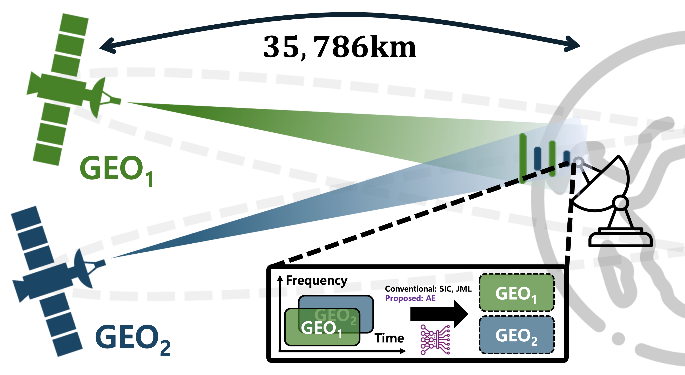
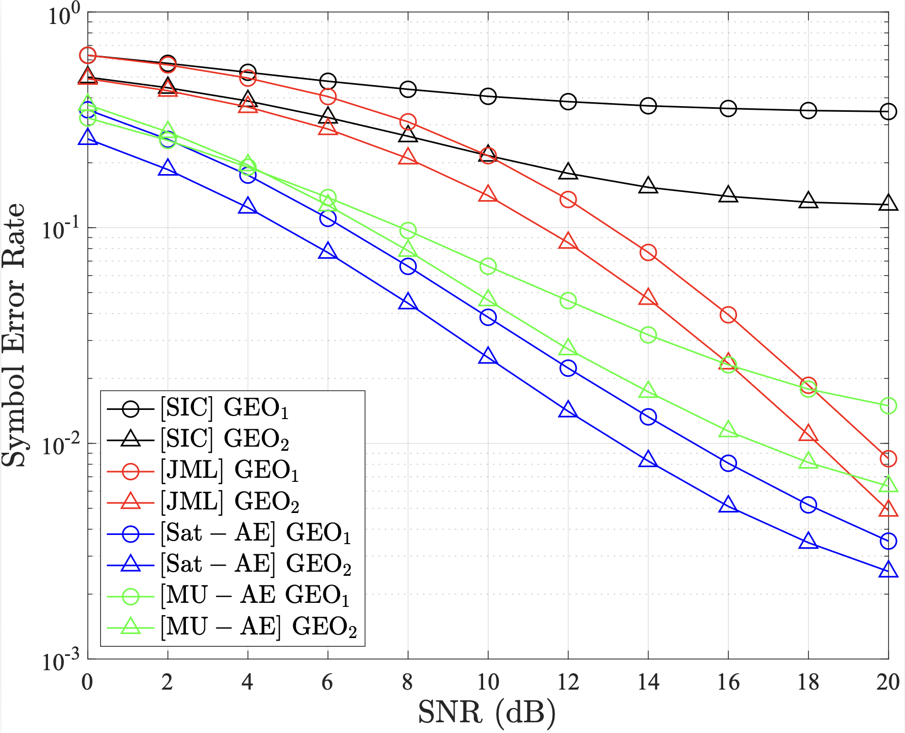

# Sat-AE: Autoencoder-Based Constellation Redesign for Joint Operation of Dual Geostationary Earth Orbit Satellites

[](https://ieeexplore.ieee.org/)
[](https://www.python.org/)
[](https://www.mathworks.com/)

Implementation code for **"Autoencoder-Based Constellation Redesign for Joint Operation of Dual Geostationary Earth Orbit Satellites"**

> **Authors:** Seungcheol Ha†, Seongmin Pyo, Dong-Hyo Lee, Taehoon Kim, and Inkyu Bang
>
> **Submitted in:** IEEE Communications Letters

---

## Overview
AE-GEO is a practical and lightweight **autoencoder-based constellation redesign framework** for spectrum-sharing dual GEO satellite downlink systems. It leverages an end-to-end autoencoder to jointly learn signal encoding/decoding and channel-adaptive constellation reconfiguration, enabling a single ground base station (GBS) to reliably separate and reconstruct superimposed signals under satellite fading conditions, while achieving improved symbol error rate (SER) performance compared to conventional SIC and joint maximum-likelihood (JML) receivers. 

### Key Features
- **AE-based End-to-End Learning Framework**: Leverages a deep learning-based autoencoder (AE) to jointly optimize the signal encoding (GEO satellite) and decoding (GBS) processes.
- **Constellation Reconfiguration**: Minimizes inter-satellite interference (ISI) in shared frequency bands by reconfiguration the constellation.
- **Dual-Satellite Joint Operation with Single GBS**: Supports a backward-compatible strategy allowing two GEO satellites to transmit simultaneously on the same frequency.
- **Shadowed-Rician Fading**: Incorporates customized neural network layers and activation functions optimized directly for Shadowed-Rician fading channels.
- **SER Performance**: Demonstrates significantly lower Symbol Error Rate (SER) compared to conventional SIC (Successive Interference Cancellation) and JML (Joint Maximum Likelihood) receivers.

### Performance Highlights

- High reconstruction precision **98% or more at 20dB SNR** in shadowed-rician fading environments
- **Rapid training convergence** with exceptional data efficiency
- Advanced **multi-user(Satellite) interference (MUI)** suppression via geometric shaping
- Edge AI Optimized Architecture for **Real-Time Satellite Communications**


## Project Structure

```

AE-GEO/
├── src/
│   ├── main.py              # Execution Control (Training Loops, Gradient Steps, Test Scenarios)
│   ├── models.py            # Neural Network Architectures (Encoder, Decoder, Normalization Layers)
│   ├── channel.py           # Physical Layer Simulation (Shadowed Rician H Gen, Fading/AWGN Layers)
│   ├── utils.py             # Numerical Ops & Data Handling (SNR-to-Noise, SER Calculation, Batch Gen)
├── data/
│   └── constellations/      # Storage for Trained Symbol Coordinates (CSV format)
├── figures/                 # Publication-ready Figures (SER Curves, Constellation PNGs)
└── results/                 # Numerical Simulation Data (SER results, Training Logs)

```

---

## Installation

### Requirements

```bash
pip install -r requirements.txt
```
### Dependencies
- TensorFlow >= 2.20.0 (Keras 3.0 compatible)
- numpy, pandas, matplotlib (Data processing & Visualization)
- scikit-learn > = 1.7.2

### Hardware & Environment
**macOS (Apple Silicon)**

- **Main Processor:** Apple M4 Chip (Recommended)
- **GPU:** Integrated Apple GPU
- **Memory:** 8GB RAM (Minimum), 16GB RAM (Recommended for large-scale simulations)
- **Architecture:** ARM64

---

## Usage

### 1. Training the Model
```bash
# Run with default configuration
python main.py
# Run with custom hyperparameters
python main.py --num-epochs 50 --batch-size 1024 --lr 0.006
```
**Configuration:**
- Modulation Order: $M_1=8$ (User 1), $M_2=4$ (User 2)
- Channel Model: Shadowed-Rician
- Normalization: Average power constraint $P \leq 1$

**Key Arguments:**
- --num-samples: Number of training samples (Default: 500,000)
- --training-snr: SNR level used during the training phase (Default: 20dB)
- --n-test: Number of samples for the testing/evaluation phase (Default: 1,000,000)

### 2. Evaluation & Output
**Outputs:**
- results/[TAG]_SER.png: Plot comparing SER performance across SNR levels.
- results/[TAG]_Results.csv: Numerical data for the SER curves.
- results/[TAG]_Constellation.csv: Learned constellation coordinates of the Autoencoder.
**Note:** After training, the script automatically evaluates the Symbol Error Rate (SER) across various SNR levels.

### 3. Configuration (YAML)
```bash
# Run using a specific configuration file
python main.py --config config.yaml
```

### Command Line Arguments
| Argument | Description | Default |
| :--- | :--- | :--- |
| --num-samples | Number of training message samples| 500,000 |
| --num-epochs | Number of training iterations | 25 |
| --batch-size | Number of samples per gradient update | 512 |
| --lr | Learning rate for Adam optimizer | 0.006 |
| --training-snr | SNR (dB) used during training | 20 |
| --n-test | Total samples for validation | 1,000,000 |

### Training Parameters (Autoencoder)
| Parameter | Value |
| :--- | :--- |
| Optimizer | Adam |
| Loss Function | Categorical Cross-Entropy |
| Mini-batch Size | 512 |
| Max Epochs | 25 |
| Training SNR | 20 dB |
| Normalization | Average Power Constraint ($P \le 1$)|
| Activation (Hidden) | ReLU |
| Activation (Output)	| Softmax |

### System Parameters 
| Parameter | Symbol | Value | Description |
|-----------|--------|-------|-------------|
| GEO1 satellite modulation | $M1_$ | $8$ | GEO1 satellite modulation method |
| GEO2 satellite modulation | $M2_$ | $4$ | GEO2 satellite modulation method |
| GEO1 satellite dimensions | $n1_$ | $2$ | Number of dimensions GEO1 satellite|
| GEO2 satellite dimensions | $n2_$ | $2$ | Number of dimensions GEO2 satellite|
| Shadowed-Rician $b$ | $b$ | $0.126$ | Scattering parameter |
| Shadowed-Rician $m$ | $m$ | $10.1$ | Shape parameter |
| Shadowed-Rician $\Omega$ | $m$ | $9.97 \tiems 10^-4$ | Average power |

---

## Results


| SNR | GEO1 SER (Sat-AE) | GEO1 SER (SIC) | GEO1 SER (JML) | GEO1 SER (MU-AE) |
| :---: | :---: | :---: | :---: | :---: |
| 0 | 0.352 | 0.603 | 0.603 | 0.371 |
| 2 | 0.256 | 0.530 | 0.530 | 0.277 |
| 4 | 0.175 | 0.448 | 0.448 | 0.194 |
| 6 | 0.110 | 0.363 | 0.363 | 0.126 |
| 8 | 0.066 | 0.279 | 0.279 | 0.078 |
| 10 | 0.038 | 0.209 | 0.209 | 0.046 |
| 12 | 0.022 | 0.153 | 0.153 | 0.027 |
| 14 | 0.013 | 0.112 | 0.112 | 0.017 |
| 16 | 0.008 | 0.085 | 0.085 | 0.011 |
| 18 | 0.005 | 0.067 | 0.067 | 0.008 |
| 20 | 0.003 | 0.056 | 0.056 | 0.006 |

## Supplementary Materials
Due to the page limitations of IEEE Communications Letters additional experimental results and technical details are provided in the [`supplementary/`](supplementary/) directory:

| Document | Description |
| :---: | :---: |
| [Channel_Specificity_Analysis.md](Channel_Specificity_Analysis.md) | Comparative analysis of performance in Shadowed-Rician vs. Rayleigh channels. |
| [Architecture_Optimization_Analysis.md](Architecture_Optimization_Analysis.md) |  Ablation studies on layer depth and activation functions to justify AE design. |
| [Power_Difference_Robustness_Analysis.md](Power_Difference_Robustness_Analysis.md) |  Robustness evaluation across various transmit power gaps (0 dB to 12 dB). |
| [Geometric_Structure_and_Dimensional_Separation.md](Geometric_Structure_and_Dimensional_Separation.md) | Geometric interpretation of dimensional separation and constellation shaping for $n=4$. |


## Citation

*Citation information will be added upon publication.*

---

## License

This project is licensed under the MIT License - see the [LICENSE](LICENSE) file for details.

---

## Acknowledgements

- **Channel model**: M. R. Bhatnagar and A. M.K., "On the Closed-Form Performance Analysis of Maximal Ratio Combining in Shadowed-Rician Fading LMS Channels," in IEEE Communications Letters - Shadowed Rician fading channel modeling
- **m-user Autoencoder Framework**: D. Wu, M. Nekovee and Y. Wang, "Deep Learning-Based Autoencoder for m-User Wireless Interference Channel Physical Layer Design," in IEEE Access - Autoencoder comparison techniques

---

## Contact

For questions or collaboration inquiries, please open an [issue](https://github.com/Seungcheol-ICIS/AE-GEO/issues) or contact the corresponding author listed in the paper.
- Seungcheol Ha: scha@edu.hanbat.ac.kr
- Inkyu Bang: ikbang@hanbat.ac.kr
