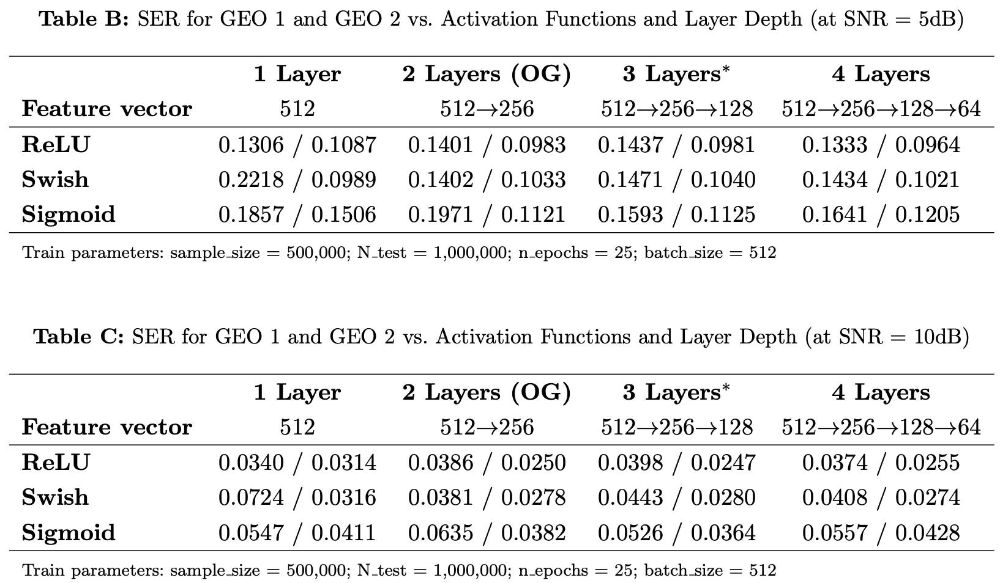
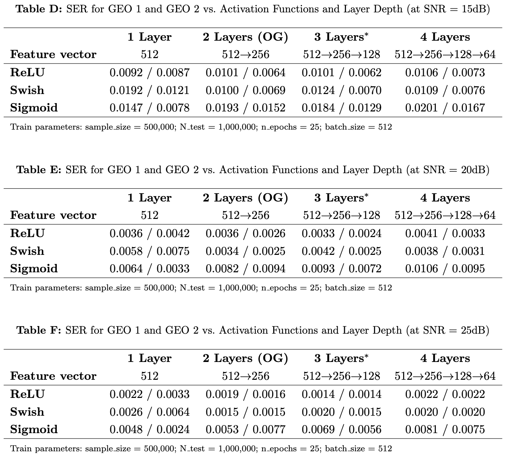

# Architecture Optimization and Design Rationale of the Autoencoder (R2.3)

**Reviewer Comment (R2.3):** "The description of the autoencoder architecture is too brief, lacking justification for the choice of network layers or computational complexity, which could hinder practical implementation; the authors should elaborate on design decisions, such as the rationale behind activation functions."

## Overview
This document provides a detailed justification for the architectural choices of the proposed Autoencoder (AE) framework, addressing the design decisions regarding layer depth, activation functions, and computational complexity.

### Simulation Setup
* **Terrestrial Channel:** Rayleigh fading channel.
* **Satellite Channel:** Shadowed-Rician (SR) fading channel.
* **Metric:** Symbol Error Rate (SER) and relative improvement rate.

### Simulation Result
<table align="center">
  <tr>
    <td align="center">
      
       
    </td>
    <td align="center">
      
       
    </td>
  </tr>
</table>

# Architecture Optimization and Design Rationale of the Autoencoder

This document provides a detailed justification for the architectural choices of the proposed Autoencoder (AE) framework, addressing the design decisions regarding layer depth, activation functions, and computational complexity.

### 1. Layer Depth Optimization (Ablation Study)
We evaluated the Symbol Error Rate (SER) performance by varying the number of fully connected layers (from 1 to 4 layers) to find the optimal balance between performance and complexity.

* **1-2 Layers:** Demonstrated reasonable performance but was insufficient for capturing complex satellite channel characteristics.
* **3 Layers (Selected):** Yielded superior SER performance across the entire SNR spectrum (5 dB to 25 dB). This depth effectively minimizes interference in shadowed-Rician fading channels.
* **4 Layers:** Did not provide meaningful gains and introduced unnecessary computational overhead.
* **Conclusion:** A **3-layer structure (512 → 256 → 128)** was selected as the optimal architecture.

### 2. Selection of Activation Function
We compared **ReLU, Swish, and Sigmoid** functions to determine the most effective non-linear mapping for the satellite environment.

* **ReLU (Selected):** Consistently outperformed others. It effectively mitigates the vanishing gradient problem during end-to-end training.
* **Rationale:** ReLU enables the network to learn a distinct multidimensional constellation mapping that is highly resilient to severe superimposed interference.

### 3. Summary of Design Decisions
The proposed AE framework is the result of comprehensive optimization considering the unique characteristics of the satellite channel:

---
*For full simulation data (Tables B to F), please refer to the detailed logs in this repository or open an [issue](https://github.com/Yongjae-ICIS/SecureLEO/issues).*