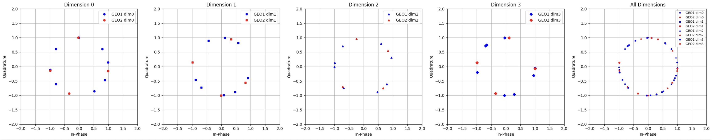

# Geometric Structure and Multidimensional Constellation Shaping (R3.5)

**Reviewer Comment (R3.5):** "Fig. 2 demonstrates separation of the two symbol dimensions, but the manuscript should provide more explanation of how the encoder implicitly assigns geometric structure."

## Overview

This document provides a deeper insight into how the proposed Autoencoder (AE) encoder implicitly assigns geometric structures to signals to ensure effective separation and interference mitigation.

### Rationale for Geometric Assignment
The encoder does not follow an arbitrary mapping. Instead, it learns a geometric structure through 

**end-to-end joint optimization**:
* **Objective:** Maximizing classification accuracy at the decoder by minimizing the total cross-entropy loss.
* **Mechanism:** The encoders for both satellites collaboratively identify a constellation structure that **maximizes Euclidean distance** in the combined signal space.
* **Outcome:** The AE autonomously learns a "multidimensional constellation shaping" strategy, which minimizes mutual interference while maximizing distinguishability at the Ground Base Station (GBS).

### Dimensional Separation (Extending to n=4)
To demonstrate the effectiveness of this strategy beyond the n=2 case shown in the manuscript, we analyzed the encoder's behavior for an extended codeword length (**n=4**).

#### Key Observations:
* **Strategic Mapping:** Rather than concentrating signals into a single resource, the AE converts symbols into codewords across four channel uses (Dimensions 0 to 3).
* **Interference Mitigation:** By leveraging extended dimensions, the encoder arranges symbols of GEO 1 and GEO 2 to avoid direct overlap, allowing the receiver to decouple superimposed signals easily.

### Visualization: n=4 Constellation Mapping
The following figure illustrates how the AE utilizes four-dimensional space to achieve superior signal separation compared to conventional 2D modulations.

  
   
  <b>Dimensional separation and symbol arrangement for n=4 codeword length.</b>

### Conclusion
The AE-based framework effectively performs **implicit geometric shaping**. This dimensional separation is the core reason why our proposed scheme outperforms fixed standard modulations (like 8-PSK) which lack such adaptive geometric advantages.

---