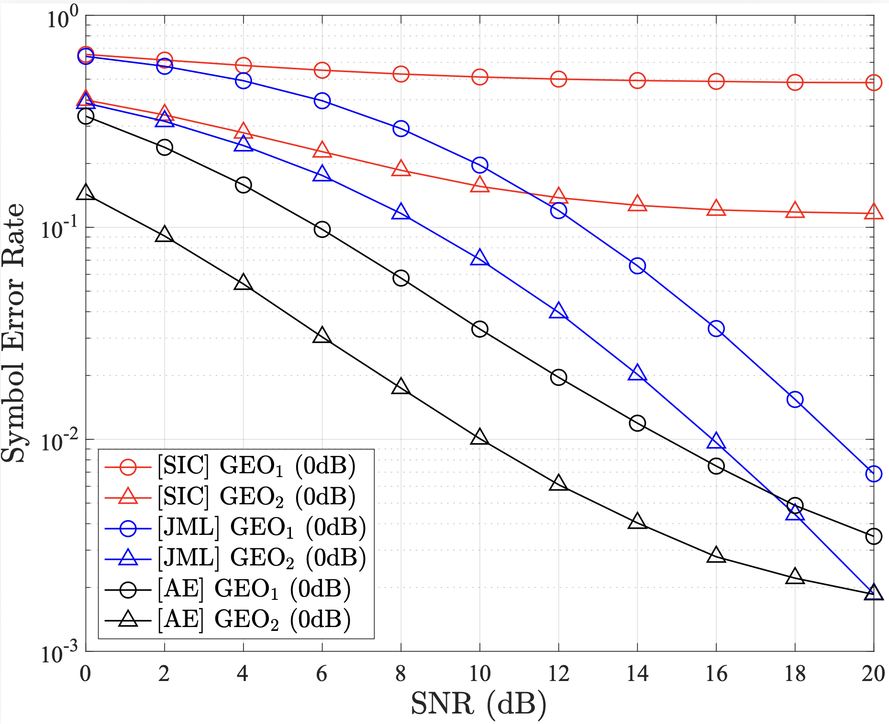
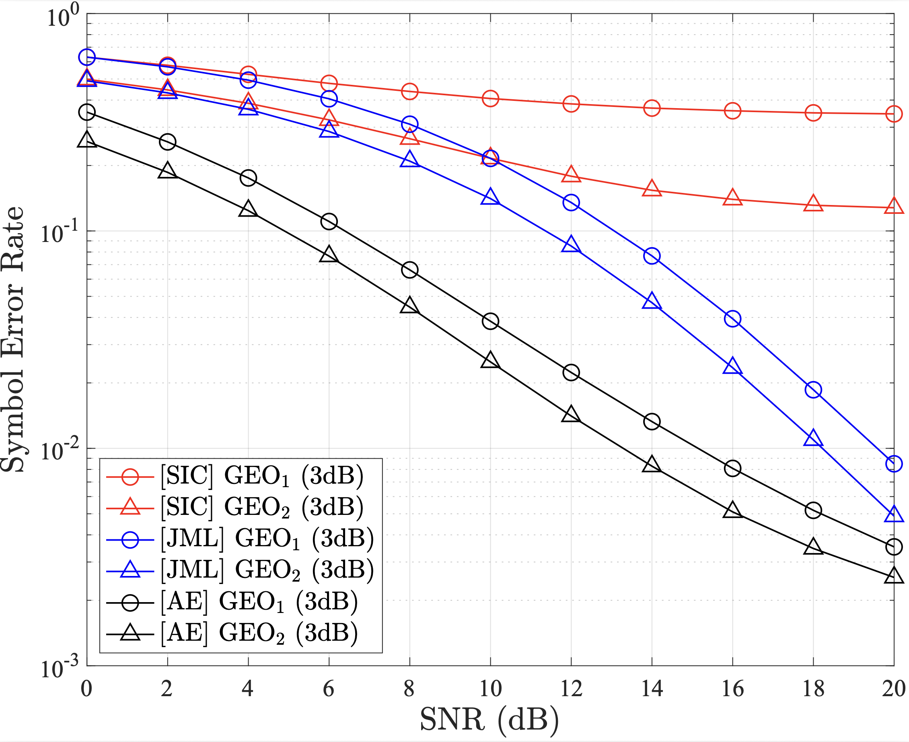
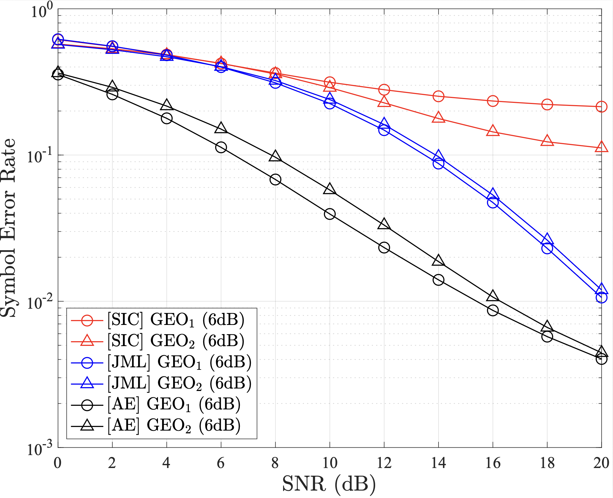
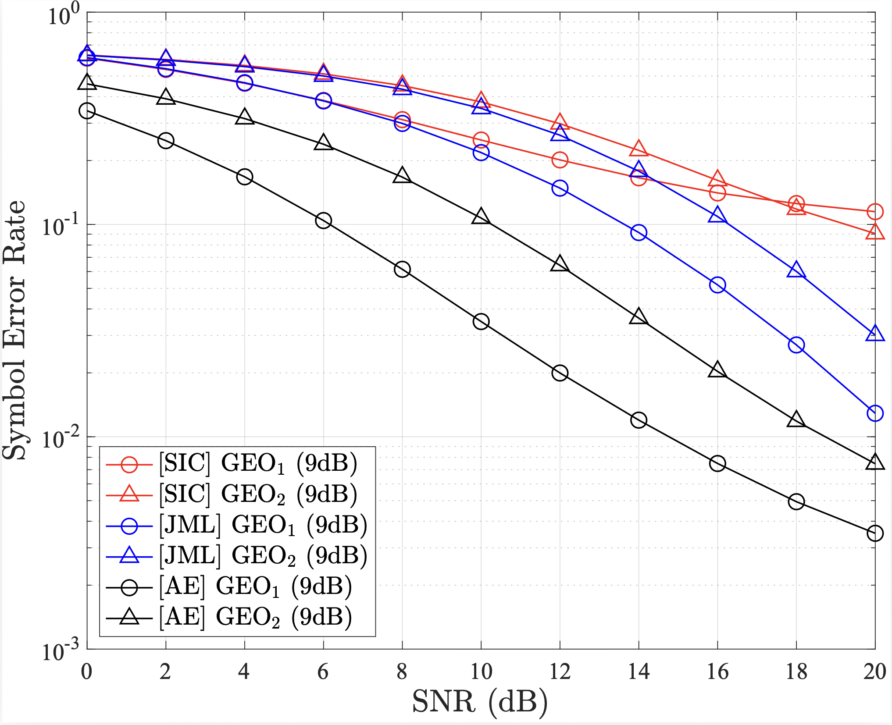
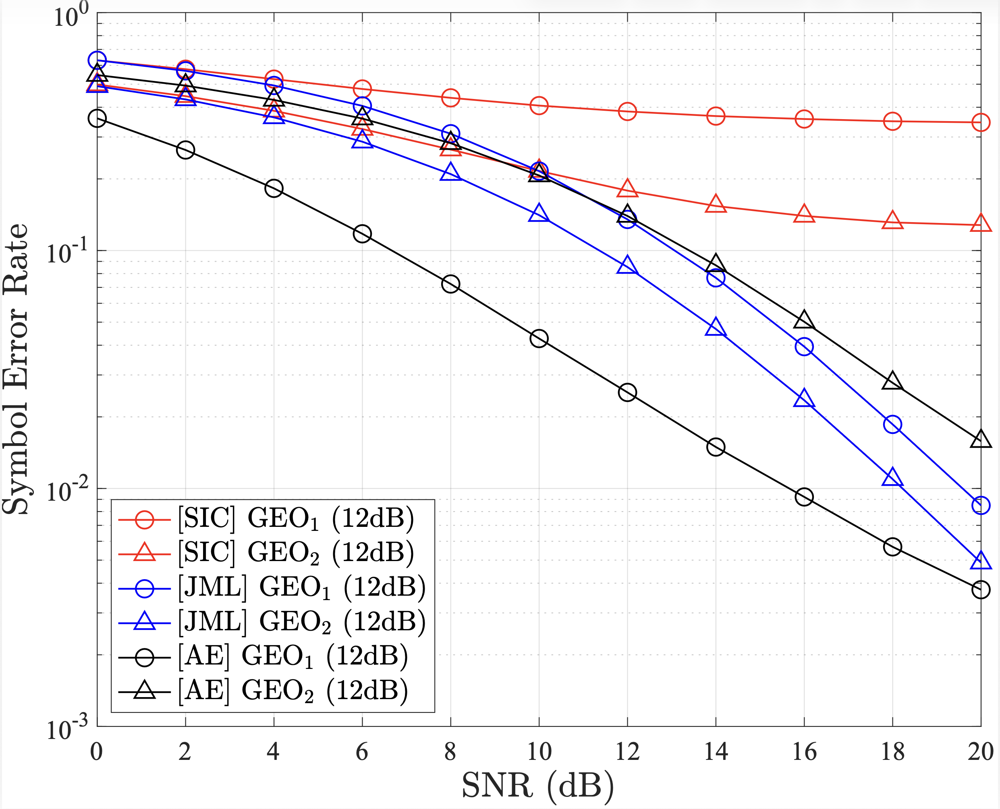

# Robustness Analysis under Varying Transmit Power Differences (R2.3)

**Reviewer Comment (R2.3):** "The simulation experiments are limited to fixed power di↵erences and specific modulation orders"

## Overview

This document explores the impact of varying transmit power differences (SNR differences) between two GEO satellites to evaluate the general robustness of the proposed Autoencoder (AE) framework.

### Simulation Setup
We evaluated the Symbol Error Rate (SER) performance across a wide range of power differences to simulate diverse operational scenarios:
* **Power Differences:** 0 dB, 3 dB, 6 dB, 9 dB, and 12 dB.
* **Baseline Methods:** Conventional Successive Interference Cancellation (SIC) and Joint Maximum Likelihood (JML) receivers.

### Key Findings

#### A. Low Power Difference (0 dB - 3 dB)
* **SIC/JML:** The SIC receiver suffers from severe error propagation, leading to an uncorrectable error floor. JML performs better but is limited by fixed standard modulations (e.g., 8-PSK).
* **Proposed AE:** Effectively mitigates severe interference through **multidimensional constellation shaping**, significantly outperforming conventional receivers.

#### B. High Power Difference (9 dB - 12 dB)
* **Observation:** As the power gap increases, the stronger signal (GEO 1) dominates the signal space, making it easier for all receivers to distinguish the signals.
* **Result:** While the JML receiver's performance improves and approaches the AE scheme, the **proposed AE still maintains superior SER performance**, demonstrating consistent robustness regardless of the power ratio.

### Performance Visualization (Varying SNR Gaps)

  
  
  
   
  
  
  
  
<b>SER performance under varying transmit power differences (0, 3, 6, 9, 12 dB).</b>

### 4. Conclusion
The proposed AE-based framework is not only optimized for a specific setup but is highly adaptive to various power imbalance scenarios, proving its practicality in real-world satellite communication environments.

--- 